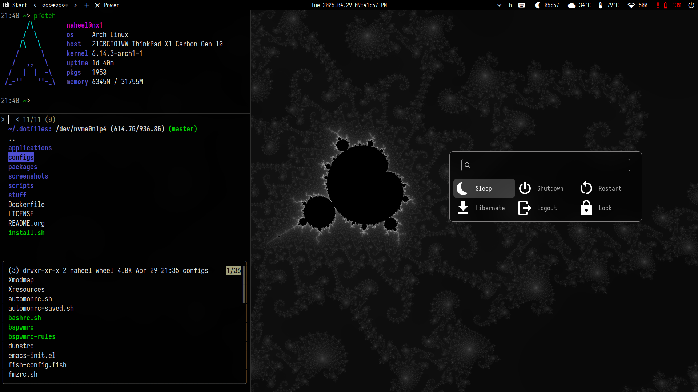

* Naheel's Personal Dotfiles/Desktop
A collection of toys glued together to buildup my setup on my machines.

Warning: Use at your own responsibility. This collection of software is not stable and might explode at any moment.

Note that this is a reconstruction of the previous old dotfiles to be more like an installable package.

** Main components
- emacs
- zsh
- xterm
- [[https://github.com/Naheel-Azawy/fmz][fmz]]
- tmux everywhere ([[https://github.com/Naheel-Azawy/theterm][theterm]])
- bspwm
- lemonbar
- [[https://github.com/Naheel-Azawy/sxiv][sxiv]] (custom fork)
- mpd and ncmpcpp
- bunch of other stuff

** Install
Arch Linux is expected to be already installed with a working internet connection.
Parabola may work, will see later.
#+begin_src shell
  curl -L https://naheel.xyz/dots > /tmp/nd.sh && sh /tmp/nd.sh base base-gui
#+end_src

If no Arch/Parabola installed, the following installer can make things easy
#+begin_src shell
  curl -L https://naheel.xyz/dots > /tmp/a.sh && sh /tmp/a.sh
#+end_src

*Other notes:*
- Pass ~--docker~ option to create a playground docker image.
- Pick any package groups you're comfortable with other than ~base~ and ~base-gui~. Tables are under ~packages~ directory.

** Update
Using [[https://github.com/Naheel-Azawy/pacgit][pacgit]]:
#+begin_src shell
  pacgit -S https://github.com/Naheel-Azawy/nd
#+end_src

** License
GPL3
